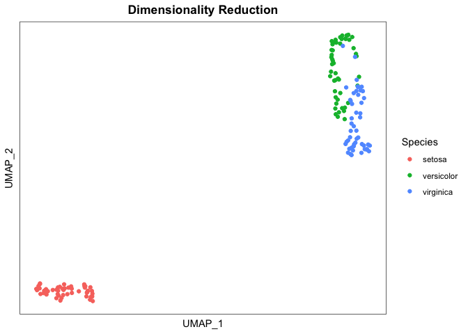

<!-- README.md is generated from README.Rmd. Please edit that file -->

# easyumap

<!-- badges: start -->

[](https://lifecycle.r-lib.org/articles/stages.html#experimental)
[](https://CRAN.R-project.org/package=easyumap)
<!-- badges: end -->

Easyumap simplifies umap visualisation and production of interactive
visualisations that can be composed and cross-linked with other
visualisations.

## Installation

You can install the development version of easyumap like so:

``` r
if (!require("remotes"))
    install.packages("remotes")

remotes::install_github("selkamand/easyumap")
```

## Quick Start

``` r
library(easyumap)

umap_result <- umap(iris, n_neighbors = 30, seed = 111)
#> ℹ Dropping 1 categorical columns: [Species]
#> ℹ Running UMAP from [4] numeric columns
umap_plot(umap_result, col_colour = "Species")
```



## Acknowledgements

easyumap is powered by the uwot package. If you find easyumap useful
please cite in accordance with `citation("uwot")`
